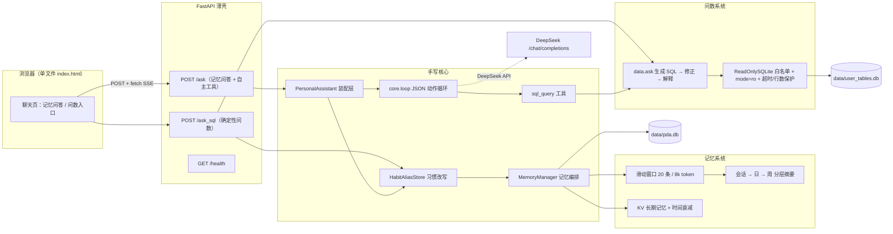

# Personal Data Assistant（个人数据助手）

一个用于找实习的作品级项目：把平时收藏的文章、笔记、聊天重点喂给它，它整理成
可检索的个人记忆；再用大白话问它“我上周学了什么”“八月吃饭花了多少钱”，它能
查记忆、查 SQLite 小数据表、算结果并解释。它还会记住你的用词习惯，越用越懂你。

## 项目定位

- 模型：DeepSeek API（OpenAI 兼容接口），密钥放环境变量。
- 栈：Python 3.10+（开发机用 uv + Python 3.10）+ httpx + SQLite + FastAPI +
  pytest。长期记忆检索手写时间衰减，不依赖向量库；前端单文件原生实现，无构建工具链。
- 约束：不用 LangChain、不用 openai SDK，不用重量级框架；核心机制（工具循环、
  记忆、检索、Text-to-SQL）全部手写。
- 可靠性：所有对外调用带超时、重试和降级，失败必须有 B 计划，不许崩溃。
- 评测：记忆 56 题四策略重放 + SQL 25 题（含 5 道陷阱题），全部可离线重复。

## 当前进度

| 里程碑 | 内容 | 状态 |
| ------ | ---- | ---- |
| M0 | 仓库骨架 + 架构设计文档 | 已完成 |
| M1 | 核心循环：模型调用 → 工具执行 → 结果回填 → 循环 | 已完成 |
| M2 | 记忆系统：滑动窗口 + 会话/日/周摘要 + SQLite + KV 时间衰减检索 + 四策略重放 | 已完成 |
| M3 | 智能问数：大白话 → 查表结构 → 写 SQL → 只读执行 → 自动修正 → 中文解释 | 已完成 |
| M4 | 网页：FastAPI 接口（/ask、/ask_sql、/health）+ SSE 流式 + 极简单页 | 已完成 |
| M5 | 评测：记忆四策略对比 + SQL 准确率/修正指标 + 汇总报告 + 最终 README | 已完成 |

## 架构图



## 目录速览

```
data-assistant/
├── docs/architecture.md   # 架构设计文档（模块、数据流、存储、评测、ADR）
├── docs/reproduce/        # M0~M5 复现指南（每本含核心概念/复现步骤/面试预演）
├── docs/assets/           # 演示动图/截图占位说明
├── src/personal_data_assistant/
│   ├── config.py          # 全局配置与默认值
│   ├── app.py             # 装配入口（记忆增强 + sql_query 工具 + 习惯改写）
│   ├── llm/               # M1 手写 httpx 客户端 + JSON 动作协议提示词
│   ├── core/loop.py       # M1 工具调用循环状态机（含 on_chunk 流式）
│   ├── memory/            # M2 窗口 / 分层摘要 / SQLite / 时间衰减检索 / 四策略重放
│   ├── data/              # M3 只读 SQL / schema 探查 / 问数编排 / 演示数据
│   ├── profile/           # M3 习惯别名（复用 KV 长期记忆）
│   ├── api/               # M4 FastAPI 路由 / 统一错误 / SSE / 极简单页
│   └── tools/             # M1 工具协议 + 注册表 + M3 sql_query
├── tests/                 # pytest 测试（179 个用例，默认不跑真实 API）
├── data/                  # SQLite 系统库、样例数据
├── evals/                 # M5 题集 / runner / 判分 / 报告
│   ├── questions/         # memory_50.json（56 题）+ sql_questions.json（25 题）
│   └── reports/           # M5-eval.md + 两份 JSON 原始结果
├── pyproject.toml         # Python >=3.10,<3.13 工程配置
├── PROGRESS.md            # 每步的进度、坑、复现要点
└── .env.example           # 环境变量模板（复制为 .env 使用）
```

## 快速开始

```bash
cd /home/hujiao/projects/data-assistant
uv venv --python 3.10 .venv
uv pip install --python .venv/bin/python -e '.[dev]'
cp .env.example .env   # 填入 DEEPSEEK_API_KEY

# 生成本地问数演示库（data/user_tables.db）：
PYTHONPATH= .venv/bin/python scripts/seed_user_tables.py

# 本机有 ROS 注入 PYTHONPATH，测试必须清空它，否则 pytest 会加载 ROS 插件报错：
PYTHONPATH= .venv/bin/python -m pytest

# M5 一键离线评测（无需密钥），产出 evals/reports/M5-eval.md：
PYTHONPATH= .venv/bin/python evals/run_all_evals.py

# 启动 M4 网页（浏览器打开 http://127.0.0.1:8000）：
PYTHONPATH= .venv/bin/python -m personal_data_assistant.api.main
```

默认不跑真实 DeepSeek（integration 标记被排除）。确认 `.env` 已配置密钥后，
可以显式冒烟：`PYTHONPATH= .venv/bin/python -m pytest -m integration`。

## 演示动图 / 截图

| 素材 | 内容 | 状态 |
| ---- | ---- | ---- |
| `docs/assets/demo-memory.gif` | 喂 3~5 条素材后问“我最近学了什么”，展示 SSE 逐块输出与工具折叠 | 占位（M5 验收未录制） |
| `docs/assets/demo-sql.png` | 问“八月餐饮花了多少”，展示中文解释、SQL 原文与结果表 | 占位 |
| `docs/assets/demo-health.png` | `/health` 组件状态截图 | 占位 |


录制与替换规则见 `docs/assets/README.md`。

## 里程碑与指标总表

| 里程碑 | 验收标准 | 结果 |
| ------ | -------- | ---- |
| M0 | 骨架 + 契约测试 | 7 项契约测试通过 |
| M1 | 核心循环 + 客户端 + 工具协议 | 55 passed, 2 deselected |
| M2 | 记忆系统 + 四策略重放 | 90 passed, 4 deselected |
| M3 | 只读问数 + 自纠错 + 别名 | 159 passed, 5 deselected |
| M4 | FastAPI + SSE + 单页 | 172 passed, 5 deselected |
| M5 | 评测体系 + 最终 README | **179 passed, 5 deselected**（integration 无密钥 5 skipped） |

M5 指标汇总（离线 fake 模式，命令 `PYTHONPATH= .venv/bin/python evals/run_all_evals.py`）：

| 评测 | 关键指标 | 数值 |
| ---- | -------- | ---- |
| 记忆（56 题） | none / window / window_summary / full 命中率 | 0% / 32.14% / 71.43% / 100% |
| 记忆（56 题） | 四策略答题 token 成本（估算费用） | 16,769（¥0.0419）/ 39,932（¥0.0880）/ 348,171（¥0.7042）/ 353,086（¥0.7136） |
| SQL（25 题，5 陷阱） | 结果一致率 / 首次成功率 / 修正成功率 / 平均修正轮数 | 100% / 76% / 100% / 0.24 |
| SQL（25 题） | 总 token / 估算费用 / 非只读陷阱数据保护 | 31,157 / ¥0.0685 / 快照证明未变 |

## 设计取舍

### 为什么不用原生 function calling，两者区别

| 维度 | 原生 function calling（OpenAI tools 参数） | 本项目 JSON 动作协议 |
| ---- | ------------------------------------------- | -------------------- |
| 协议位置 | 请求体带 `tools`/`tool_choice`，响应带 `tool_calls`、`tool_call_id` | 工具 JSON Schema 写进 system prompt，模型输出 `{"action":"tool","tool":...,"args":...}` |
| 回填方式 | 必须用 `role=tool` 并按 `tool_call_id` 配对 | 用 `role=user` 回填 `{"tool_result":...}`，任何聊天模型都接受 |
| 可观测性 | 调用意图藏在 SDK/响应字段里，调试要翻请求日志 | 模型原话就是动作 JSON，轨迹一眼可读、可直接 mock |
| 可降级性 | 模型/服务不支持 function calling 时整条路断掉 | 不支持 function calling 的文本模型也能照常走通 |
| 失败恢复 | 格式错误通常由服务端/SDK 报错，难把错误回填给模型 | 解析失败、未知工具、参数错误都作为消息回填，模型可自行修正 |
| 成本 | 工具定义放在请求参数，通常不进计费 prompt | 工具 JSON Schema 占 prompt token，工具多时会变长 |

选择 JSON 动作协议的理由：本项目要“可观测、可 mock、可降级、不绑定 SDK”，
而不是追求最小 prompt 开销。

### 为什么 M2 长期记忆先做 KV 时间衰减，不做向量检索

长期记忆检索公式为 `相关性 × 权重 × exp(-decay_lambda × 年龄天数)`：只依赖
标准库 SQLite，离线可测、结果可解释，个人记忆库几千条以内完全够用。语义向量
作为后续增强通道，替换时只动 `MemoryDatabase.search_memories` 内部，返回形状不变。

### 为什么 M3 的 SQL 安全是“三层闸”，而不是只靠提示词

1. **白名单**：单条语句且必须以 `SELECT`/`WITH` 开头；`INSERT/UPDATE/DELETE/
   PRAGMA` 与多语句在进 SQLite 前拒绝。
2. **只读连接**：SQLite URI `mode=ro` + `PRAGMA query_only=ON`，防
   `WITH ... DELETE` 这类形态穿透。
3. **执行超时 + 行数上限**：progress handler 到点中断，`fetchmany(max_rows+1)`
   限制回传内存。

错误修正子循环把「失败 SQL + 真实错误」回填模型，最多重写 3 次；耗尽就返回
“原因 + 试过的 SQL”，绝不假装成功。

### 为什么 M4 前端只有一个 HTML，SSE 用 fetch 手写解析

- 前端单文件 + 原生 JS + 内嵌 CSS，没有 npm/打包器，复现成本为零。
- 流式接口是 POST（要带 question 与 timeout），`EventSource` 不支持 POST body；
  所以用 `fetch` + `ReadableStream` 按 `\n\n` 拆 SSE 事件。
- API 层的 `StreamActionFilter` 把工具调用 JSON 折进 `tool` 事件，只把
  `final.answer` 正文作为 `chunk` 事件，用户看不到半截 JSON。
- 所有接口错误统一 `{"error":{"code","message","detail?"}}`。

### 为什么 M5 评测默认全部 fake，而不是先跑真实 DeepSeek

面试官常问“评测结果可信吗”。本项目的答案分两层：

- **工程验收必须可重复**：题集、脚本化 SQL 模型、确定性记忆 oracle、规则/行集
  判分全部离线，任何评审者没有 API 密钥也能跑出一模一样的指标；真实 API 的
  网络抖动、模型版本升级、扣费重试都不会污染验收基线。
- **真实模型是可替换的第二档**：`evals/sql_eval.py` 只换 model 工厂就能接
  `DeepSeekClient`，判分与聚合不变；记忆评测保留 `expected_strategies` 作回归
  基线，接 LLM-as-judge 时先跑 10 题小样本再跑全量。

离线记忆指标明确标注为“检索完备性上界”（oracle 只在上下文确实含证据时回答），
因此报告里的 100% 不是“模型考试满分”，而是“full 策略的检索通道覆盖了全部 56 题”。
这是设计取舍，不是指标注水。

### 为什么手写 httpx 而不是用 openai SDK

openai SDK 在超时、重试、流式与 token 计量上都有自己的一层默认行为，出问题时
很难定位是 SDK 还是服务端；本项目只需要 `POST /chat/completions` 一个端点，
用 httpx 手写一个客户端模块就能同时拿到：连接/读取超时、指数退避重试、SSE 拆包、
流失败自动降级非流式、usage 缺失时的粗估计量。协议只是 HTTP + JSON，
不值得为它引入依赖和黑盒。

## 开发纪律（全程遵守）

1. 测试先行：每个里程碑先写 pytest 测试，看它失败，再写实现让它通过。
2. 每完成一步更新 `PROGRESS.md`：进度、踩过的坑、复现要点。
3. 每个代码文件顶部写 3~5 行中文注释，说明设计取舍。
4. 对外调用必须可超时、可重试、可降级，禁止静默崩溃。
5. 不引入 LangChain 及任何重量级框架。

## 非目标（明确不做）

多智能体、分布式、登录系统、追 benchmark 排名。本项目唯一“排行榜”是 M5
自己四策略的对比表，目的是展示工程判断，不是刷分。
